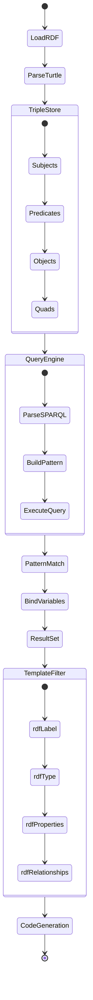

# RDF Processing Designer - Semantic Data Integration

The RDF Processing Designer enables semantic data modeling and knowledge graph integration within the Unjucks template generation system.

## Architecture Overview



## Core Components

### RDF Data Loader

```typescript
interface RDFLoader {
  loadTurtle(source: string | Buffer): Promise<Triple[]>
  loadJSONLD(data: object): Promise<Triple[]>
  loadFromURL(url: string): Promise<Triple[]>
  validateSyntax(content: string): ValidationResult
}

interface Triple {
  subject: NamedNode | BlankNode
  predicate: NamedNode
  object: NamedNode | BlankNode | Literal
  graph?: NamedNode | BlankNode
}
```

### N3.js Integration

```typescript
import { Parser, Store, Writer, DataFactory } from 'n3'

class RDFProcessor {
  private store: Store
  private parser: Parser
  
  constructor() {
    this.store = new Store()
    this.parser = new Parser()
  }
  
  async loadTurtleFile(filePath: string): Promise<void> {
    const content = await fs.readFile(filePath, 'utf8')
    const quads = this.parser.parse(content)
    this.store.addQuads(quads)
  }
  
  query(pattern: QueryPattern): QueryResult[] {
    return this.store.getQuads(
      pattern.subject,
      pattern.predicate,
      pattern.object,
      pattern.graph
    )
  }
}
```

## SPARQL-like Query Engine

### Query Patterns

```typescript
interface QueryPattern {
  subject?: Term | Variable
  predicate?: Term | Variable
  object?: Term | Variable
  graph?: Term | Variable
  optional?: boolean
  filter?: FilterExpression
}

interface Variable {
  type: 'variable'
  name: string
}

interface FilterExpression {
  operator: 'equals' | 'contains' | 'regex' | 'exists'
  left: Term | Variable
  right: Term | Variable | Literal
}
```

### Query Execution

```typescript
class SPARQLQueryEngine {
  constructor(private store: Store) {}
  
  select(patterns: QueryPattern[]): BindingSet[] {
    let results = [new Map()] // Start with empty binding
    
    for (const pattern of patterns) {
      results = this.bindPattern(pattern, results)
    }
    
    return results
  }
  
  private bindPattern(
    pattern: QueryPattern, 
    bindings: BindingSet[]
  ): BindingSet[] {
    const newBindings: BindingSet[] = []
    
    for (const binding of bindings) {
      const boundPattern = this.applyBinding(pattern, binding)
      const matches = this.store.getQuads(
        boundPattern.subject,
        boundPattern.predicate,
        boundPattern.object,
        boundPattern.graph
      )
      
      for (const quad of matches) {
        const newBinding = this.extractVariables(pattern, quad, binding)
        if (newBinding) {
          newBindings.push(newBinding)
        }
      }
    }
    
    return newBindings
  }
}
```

## Template Integration Filters

### RDF Template Filters

```typescript
// Register RDF filters with Nunjucks
env.addFilter('rdfLabel', (uri: string, lang?: string) => {
  const labels = rdfProcessor.getLabels(uri, lang)
  return labels[0] || uri
})

env.addFilter('rdfType', (uri: string) => {
  return rdfProcessor.getTypes(uri)
})

env.addFilter('rdfProperties', (uri: string) => {
  return rdfProcessor.getProperties(uri)
})

env.addFilter('rdfRelationships', (uri: string, direction?: 'incoming' | 'outgoing') => {
  return rdfProcessor.getRelationships(uri, direction)
})

env.addFilter('sparql', (query: string) => {
  return rdfProcessor.executeSPARQL(query)
})
```

### Usage in Templates

```nunjucks
{# Get entity label #}
<h1>{{ entity.uri | rdfLabel('en') }}</h1>

{# List entity types #}
<div class="types">
  
    <span class="type">{{ type | rdfLabel }}</span>
  
</div>

{# Display properties #}
<dl class="properties">
  
    <dt>{{ prop.predicate | rdfLabel }}</dt>
    <dd>{{ prop.object | rdfLabel }}</dd>
  
</dl>

{# Complex SPARQL query #}


<ul class="related">
  
    <li>{{ item.label }}</li>
  
</ul>
```

## Knowledge Graph Templates

### Schema.org Integration

```turtle
@prefix schema: <https://schema.org/> .
@prefix rdfs: <http://www.w3.org/2000/01/rdf-schema#> .

schema:Person a rdfs:Class ;
  rdfs:label "Person" ;
  rdfs:comment "A person (alive, dead, undead, or fictional)." .

schema:name a rdf:Property ;
  rdfs:domain schema:Person ;
  rdfs:range schema:Text ;
  rdfs:label "name" .

schema:email a rdf:Property ;
  rdfs:domain schema:Person ;
  rdfs:range schema:Text ;
  rdfs:label "email" .
```

### Class Generator Template

```nunjucks
---
to: src/models/{{ className | kebabCase }}.ts
inject: false
---




/**
 * {{ entity | rdfLabel }}
 * {{ entity | rdfComment }}
 */
export interface {{ className }} {
  
  
  
  
  /** {{ prop.predicate | rdfComment }} */
  {{ propName }}?: {{ propType }}
  
}

export class {{ className }}Entity implements {{ className }} {
  
  
  
  
  {{ propName }}?: {{ propType }}
  
  
  constructor(data: Partial<{{ className }}>) {
    
    
    this.{{ propName }} = data.{{ propName }}
    
  }
  
  toRDF(): string {
    const writer = new Writer({ prefixes: { schema: 'https://schema.org/' } })
    
    
    
    
    if (this.{{ propName }}) {
      writer.addQuad(
        DataFactory.namedNode(`#${this.id}`),
        DataFactory.namedNode('{{ propURI }}'),
        DataFactory.literal(this.{{ propName }}.toString())
      )
    }
    
    
    return writer.end()
  }
}
```

## Ontology-Driven Development

### Vocabulary Management

```typescript
interface Vocabulary {
  namespace: string
  prefix: string
  classes: Class[]
  properties: Property[]
  individuals: Individual[]
}

interface Class {
  uri: string
  label: Map<string, string>
  comment: Map<string, string>
  subClassOf: string[]
  equivalentClass: string[]
  disjointWith: string[]
}

interface Property {
  uri: string
  label: Map<string, string>
  comment: Map<string, string>
  domain: string[]
  range: string[]
  subPropertyOf: string[]
  functionalProperty: boolean
  inverseFunctionalProperty: boolean
}
```

### Template Metadata

```yaml
# templates/rdf-entity/config.yml
name: RDF Entity Generator
description: Generate TypeScript classes from RDF/OWL ontologies
rdf:
  vocabularies:
    - schema.org
    - dublin-core
    - foaf
  queries:
    classes: |
      SELECT ?class ?label ?comment WHERE {
        ?class a owl:Class .
        OPTIONAL { ?class rdfs:label ?label }
        OPTIONAL { ?class rdfs:comment ?comment }
      }
    properties: |
      SELECT ?property ?domain ?range ?label WHERE {
        ?property a owl:DatatypeProperty .
        OPTIONAL { ?property rdfs:domain ?domain }
        OPTIONAL { ?property rdfs:range ?range }
        OPTIONAL { ?property rdfs:label ?label }
      }
```

## Semantic Code Generation

### API Generator from Ontology

```nunjucks
---
to: src/api/{{ vocabulary.prefix }}/{{ class.name | kebabCase }}.ts
inject: false
---



import { Router } from 'express'
import { {{ class.name }} } from '../models/{{ class.name | kebabCase }}'

const router = Router()

/**
 * {{ classURI | rdfLabel }}
 * {{ classURI | rdfComment }}
 */

// GET /{{ class.name | kebabCase | plural }}
router.get('/', async (req, res) => {
  try {
    const items = await {{ class.name }}.find(req.query)
    res.json({
      '@context': '{{ vocabulary.namespace }}',
      '@type': 'Collection',
      'totalItems': items.length,
      'member': items.map(item => item.toJSONLD())
    })
  } catch (error) {
    res.status(500).json({ error: error.message })
  }
})

// GET /{{ class.name | kebabCase | plural }}/:id
router.get('/:id', async (req, res) => {
  try {
    const item = await {{ class.name }}.findById(req.params.id)
    if (!item) {
      return res.status(404).json({ error: 'Not found' })
    }
    res.json(item.toJSONLD())
  } catch (error) {
    res.status(500).json({ error: error.message })
  }
})

export default router
```

## Integration Examples

### CLI Integration

```bash
# Load ontology and generate models
unjucks generate rdf-entity schema:Person --ontology=schema.org

# Generate API from SPARQL endpoint
unjucks generate rdf-api --endpoint=http://dbpedia.org/sparql --class=dbo:Person

# Create semantic documentation
unjucks generate rdf-docs --vocabulary=foaf --output=docs/api
```

### Configuration

```typescript
// unjucks.config.ts
export default {
  rdf: {
    enabled: true,
    stores: {
      default: {
        type: 'memory',
        data: ['./ontologies/**/*.ttl']
      },
      remote: {
        type: 'sparql',
        endpoint: 'http://localhost:3030/dataset/sparql'
      }
    },
    vocabularies: {
      'schema': 'https://schema.org/',
      'foaf': 'http://xmlns.com/foaf/0.1/',
      'dc': 'http://purl.org/dc/terms/'
    },
    filters: {
      typeMapping: {
        'http://www.w3.org/2001/XMLSchema#string': 'string',
        'http://www.w3.org/2001/XMLSchema#integer': 'number',
        'http://www.w3.org/2001/XMLSchema#boolean': 'boolean',
        'http://www.w3.org/2001/XMLSchema#dateTime': 'Date'
      }
    }
  }
}
```

## Benefits

- **Semantic Consistency**: Ensure generated code follows ontological constraints
- **Knowledge Reuse**: Leverage existing vocabularies and ontologies
- **Interoperability**: Generate standards-compliant data structures
- **Documentation**: Auto-generate documentation from semantic annotations
- **Validation**: Verify data integrity against ontological rules
- **Evolution**: Track changes in ontologies and update code accordingly

The RDF Processing Designer bridges the gap between semantic web technologies and practical code generation, enabling knowledge-driven development workflows.