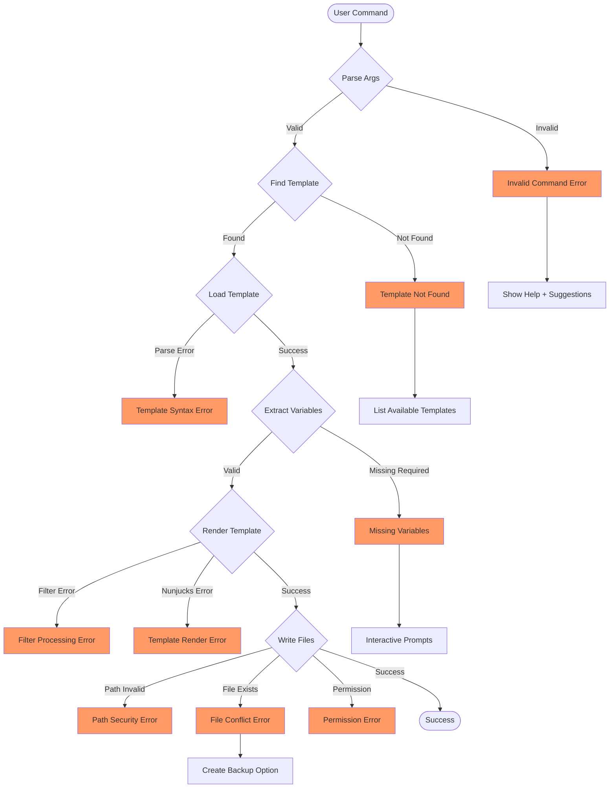

# Error Handling Architecture

## Error Flow Diagram



## Error Categories

### 1. Command Parsing Errors (ERR1)

**Triggers:**
- Invalid command syntax
- Unknown flags
- Malformed arguments

**Recovery Strategy:**
```typescript
export class CommandParseError extends Error {
  constructor(
    public command: string,
    public suggestions: string[]
  ) {
    super(`Invalid command: ${command}`)
  }
}

// Recovery
function handleParseError(error: CommandParseError) {
  console.error(`❌ ${error.message}`)
  console.log('\n💡 Did you mean:')
  error.suggestions.forEach(s => console.log(`  • ${s}`))
  console.log('\n📖 Run `unjucks help` for full documentation')
}
```

### 2. Template Discovery Errors (ERR2)

**Triggers:**
- Template not found in any search path
- Ambiguous template names
- No templates directory

**Recovery Strategy:**
```typescript
export class TemplateNotFoundError extends Error {
  constructor(
    public templateName: string,
    public searchPaths: string[],
    public availableTemplates: string[]
  ) {
    super(`Template '${templateName}' not found`)
  }
}

// Recovery
function handleTemplateNotFound(error: TemplateNotFoundError) {
  console.error(`❌ ${error.message}`)
  console.log('\n🔍 Searched in:')
  error.searchPaths.forEach(p => console.log(`  • ${p}`))
  
  if (error.availableTemplates.length > 0) {
    console.log('\n📋 Available templates:')
    error.availableTemplates.forEach(t => console.log(`  • ${t}`))
  } else {
    console.log('\n💡 Run `unjucks init` to create templates directory')
  }
}
```

### 3. Template Loading Errors (ERR3)

**Triggers:**
- Invalid frontmatter YAML
- Corrupted template files
- Encoding issues

**Recovery Strategy:**
```typescript
export class TemplateSyntaxError extends Error {
  constructor(
    public filePath: string,
    public line: number,
    public column: number,
    public details: string
  ) {
    super(`Syntax error in ${filePath}:${line}:${column}`)
  }
}

// Recovery
function handleSyntaxError(error: TemplateSyntaxError) {
  console.error(`❌ ${error.message}`)
  console.log(`   ${error.details}`)
  console.log('\n🔧 Check template syntax:')
  console.log('  • YAML frontmatter delimiters (---)')
  console.log('  • Proper indentation')
  console.log('  • Valid YAML syntax')
}
```

### 4. Variable Validation Errors (ERR4)

**Triggers:**
- Missing required variables
- Invalid variable types
- Failed validation rules

**Recovery Strategy:**
```typescript
export class MissingVariablesError extends Error {
  constructor(
    public missingVars: string[],
    public templatePath: string
  ) {
    super(`Missing required variables: ${missingVars.join(', ')}`)
  }
}

// Recovery with interactive prompts
async function handleMissingVariables(error: MissingVariablesError) {
  console.error(`❌ ${error.message}`)
  console.log('\n📝 Please provide values:')
  
  const answers: Record<string, any> = {}
  for (const varName of error.missingVars) {
    const value = await prompts({
      type: 'text',
      name: varName,
      message: `Enter ${varName}:`
    })
    answers[varName] = value[varName]
  }
  
  return answers
}
```

### 5. Filter Processing Errors (ERR5)

**Triggers:**
- Custom filter failures
- Invalid filter chains
- Runtime filter errors

**Recovery Strategy:**
```typescript
export class FilterError extends Error {
  constructor(
    public filterName: string,
    public input: any,
    public cause: Error
  ) {
    super(`Filter '${filterName}' failed`)
  }
}

// Recovery
function handleFilterError(error: FilterError) {
  console.error(`❌ ${error.message}`)
  console.log(`   Input: ${JSON.stringify(error.input)}`)
  console.log(`   Cause: ${error.cause.message}`)
  console.log('\n🔧 Check filter implementation and input data')
}
```

### 6. Template Rendering Errors (ERR6)

**Triggers:**
- Nunjucks syntax errors
- Undefined variables
- Template logic errors

**Recovery Strategy:**
```typescript
export class RenderError extends Error {
  constructor(
    public templatePath: string,
    public context: Record<string, any>,
    public cause: Error
  ) {
    super(`Render failed for ${templatePath}`)
  }
}

// Recovery
function handleRenderError(error: RenderError) {
  console.error(`❌ ${error.message}`)
  console.log(`   Cause: ${error.cause.message}`)
  console.log('\n🔍 Debug context:')
  console.log(JSON.stringify(error.context, null, 2))
  console.log('\n💡 Check template syntax and variable references')
}
```

### 7. Path Security Errors (ERR7)

**Triggers:**
- Path traversal attempts
- Invalid output paths
- Security policy violations

**Recovery Strategy:**
```typescript
export class PathSecurityError extends Error {
  constructor(
    public attemptedPath: string,
    public reason: string
  ) {
    super(`Security violation: ${reason}`)
  }
}

// Recovery
function handlePathSecurity(error: PathSecurityError) {
  console.error(`🚨 ${error.message}`)
  console.log(`   Attempted path: ${error.attemptedPath}`)
  console.log('\n🛡️ Security policies:')
  console.log('  • No path traversal (../) allowed')
  console.log('  • Output must be within project directory')
  console.log('  • System paths are forbidden')
}
```

### 8. File Conflict Errors (ERR8)

**Triggers:**
- File already exists
- Merge conflicts
- Permission issues

**Recovery Strategy:**
```typescript
export class FileConflictError extends Error {
  constructor(
    public filePath: string,
    public conflictType: 'exists' | 'merge' | 'permission'
  ) {
    super(`File conflict: ${filePath}`)
  }
}

// Recovery with backup option
async function handleFileConflict(error: FileConflictError) {
  console.error(`⚠️  ${error.message}`)
  
  const choice = await prompts({
    type: 'select',
    name: 'action',
    message: 'How would you like to proceed?',
    choices: [
      { title: 'Backup existing and overwrite', value: 'backup' },
      { title: 'Skip this file', value: 'skip' },
      { title: 'Abort operation', value: 'abort' },
      { title: 'Show diff', value: 'diff' }
    ]
  })
  
  return choice.action
}
```

### 9. Permission Errors (ERR9)

**Triggers:**
- Write permission denied
- Read-only file system
- Access control violations

**Recovery Strategy:**
```typescript
export class PermissionError extends Error {
  constructor(
    public filePath: string,
    public operation: 'read' | 'write' | 'execute',
    public systemError: NodeJS.ErrnoException
  ) {
    super(`Permission denied: ${operation} ${filePath}`)
  }
}

// Recovery
function handlePermissionError(error: PermissionError) {
  console.error(`🔒 ${error.message}`)
  console.log(`   System error: ${error.systemError.code}`)
  console.log('\n🔧 Possible solutions:')
  console.log('  • Check file permissions')
  console.log('  • Run with appropriate privileges')
  console.log('  • Choose different output directory')
}
```

## Global Error Handler

```typescript
export class ErrorHandler {
  static handle(error: Error): never {
    if (error instanceof CommandParseError) {
      handleParseError(error)
    } else if (error instanceof TemplateNotFoundError) {
      handleTemplateNotFound(error)
    } else if (error instanceof TemplateSyntaxError) {
      handleSyntaxError(error)
    } else if (error instanceof MissingVariablesError) {
      handleMissingVariables(error)
    } else if (error instanceof FilterError) {
      handleFilterError(error)
    } else if (error instanceof RenderError) {
      handleRenderError(error)
    } else if (error instanceof PathSecurityError) {
      handlePathSecurity(error)
    } else if (error instanceof FileConflictError) {
      handleFileConflict(error)
    } else if (error instanceof PermissionError) {
      handlePermissionError(error)
    } else {
      // Unknown error
      console.error('💥 Unexpected error:', error.message)
      console.log('\n🐛 Please report this issue with:')
      console.log('  • Command that failed')
      console.log('  • Template being used')
      console.log('  • Full error stack trace')
      console.log('\nStack trace:')
      console.log(error.stack)
    }
    
    process.exit(1)
  }
}
```

## Error Recovery Patterns

### 1. Graceful Degradation
- Fall back to simpler operations
- Skip optional features
- Continue with warnings

### 2. Interactive Recovery
- Prompt for missing information
- Offer multiple resolution options
- Guide user through fixes

### 3. Automatic Retry
- Retry with backoff for transient errors
- Alternative paths for permanent failures
- Circuit breaker pattern

### 4. Contextual Help
- Show relevant documentation
- Suggest corrections
- Link to common solutions

## Error Prevention

### 1. Validation Gates
- Early validation of inputs
- Schema validation for templates
- Path sanitization

### 2. Safe Defaults
- Conservative permission settings
- Non-destructive operations by default
- Explicit opt-in for dangerous actions

### 3. Clear Feedback
- Progress indicators
- Verbose logging in debug mode
- Clear success/failure messages

## Testing Error Scenarios

```typescript
describe('Error Handling', () => {
  test('handles missing template gracefully', async () => {
    const result = await unjucks.generate('nonexistent', {})
    expect(result.success).toBe(false)
    expect(result.error).toBeInstanceOf(TemplateNotFoundError)
  })
  
  test('provides helpful suggestions', async () => {
    const error = new CommandParseError('generat', ['generate'])
    const handler = new ErrorHandler()
    const output = handler.getHelpText(error)
    expect(output).toContain('Did you mean: generate')
  })
  
  test('recovers from file conflicts', async () => {
    // Setup existing file
    const conflict = new FileConflictError('test.js', 'exists')
    const recovery = await handleFileConflict(conflict)
    expect(['backup', 'skip', 'abort', 'diff']).toContain(recovery)
  })
})
```

This error handling architecture ensures robust operation with clear user guidance and multiple recovery paths for different failure scenarios.