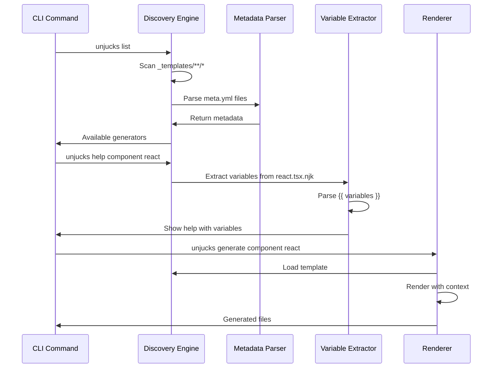
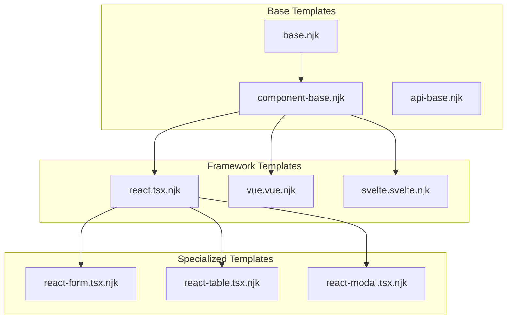
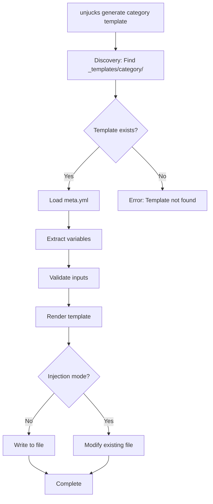
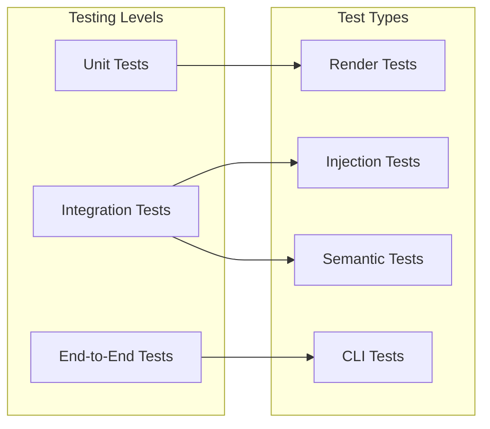

# Template Structure & Organization

## Overview

Unjucks uses a hierarchical template structure with semantic metadata and discovery patterns for scalable code generation across multiple domains.

## Template Directory Structure

```mermaid
graph TD
    subgraph "_templates/"
        subgraph "component/"
            CR[react.tsx.njk]
            CV[vue.vue.njk]
            CS[svelte.svelte.njk]
            CM[meta.yml]
        end
        
        subgraph "api/"
            AR[rest.js.njk]
            AG[graphql.js.njk]
            AM[meta.yml]
        end
        
        subgraph "semantic/"
            SO[ontology.ttl.njk]
            SK[knowledge-graph.js.njk]
            SM[meta.yml]
        end
        
        subgraph "latex/"
            LA[article.tex.njk]
            LT[thesis.tex.njk]
            LR[report.tex.njk]
            LM[meta.yml]
        end
        
        CONFIG[config.yml]
    end
    
    subgraph "Template Format"
        FRONT[Frontmatter Section]
        BODY[Template Body]
        
        FRONT --> |to:| PATH[Output Path]
        FRONT --> |inject:| MODE[Injection Mode]
        FRONT --> |skipIf:| COND[Conditions]
        FRONT --> |rdf:| SEM[Semantic Data]
        
        BODY --> |{{ vars }}| VARS[Variables]
        BODY --> || INH[Inheritance]
        BODY --> || MACRO[Macros]
        BODY --> |Filters| FILTER[|pascalCase|rdfLabel]
    end
```

## Template Discovery Process



## Template Frontmatter Schema

```yaml
# Required fields
to: "{{ outputPath }}/{{ name }}.{{ extension }}"
inject: false  # or true for injection mode

# Optional fields
skipIf: "{{ condition }}"
before: "{{ marker }}"
after: "{{ marker }}"
append: true
prepend: false
lineAt: 42
chmod: "755"
sh: "npm install {{ packageName }}"

# Semantic metadata
rdf:
  type: "https://schema.org/SoftwareSourceCode"
  describes: "{{ componentName }}"
  implements: ["{{ interface }}"]
  
# Template metadata
meta:
  description: "React component template"
  category: "frontend"
  tags: ["react", "typescript", "component"]
  variables:
    - name: "componentName"
      type: "string"
      required: true
      description: "Name of the React component"
    - name: "withProps"
      type: "boolean"
      default: false
      description: "Include props interface"
```

## Generator Metadata (meta.yml)

```yaml
name: "React Components"
description: "Generate React TypeScript components"
category: "frontend"
version: "1.0.0"
author: "Unjucks Team"

# Discovery configuration
discovery:
  pattern: "*.njk"
  exclude: ["*.test.njk", "*.spec.njk"]
  
# Default variables
defaults:
  extension: "tsx"
  withTests: false
  withStorybook: false
  
# CLI help configuration
help:
  examples:
    - command: "unjucks generate component react --name Button"
      description: "Generate a basic Button component"
    - command: "unjucks generate component react --name Card --withProps"
      description: "Generate Card component with props interface"
      
# Semantic information
semantic:
  namespace: "https://unjucks.dev/generators/component/"
  implements:
    - "https://schema.org/CreativeWork"
    - "https://unjucks.dev/ontology/Template"
```

## Template Inheritance Hierarchy



## Variable Extraction Patterns

```mermaid
flowchart LR
    subgraph "Template Scanning"
        SCAN[Scan Template]
        FRONT[Parse Frontmatter]
        BODY[Parse Body]
    end
    
    subgraph "Variable Types"
        SIMPLE[{{ variable }}]
        FILTER[{{ variable | filter }}]
        COND[]
        LOOP[]
        MACRO[]
    end
    
    subgraph "CLI Generation"
        FLAGS[--variable-name]
        HELP[Help Text]
        VALIDATE[Validation]
    end
    
    SCAN --> FRONT
    SCAN --> BODY
    
    FRONT --> SIMPLE
    BODY --> SIMPLE
    BODY --> FILTER
    BODY --> COND
    BODY --> LOOP
    BODY --> MACRO
    
    SIMPLE --> FLAGS
    FILTER --> FLAGS
    COND --> FLAGS
    LOOP --> FLAGS
    
    FLAGS --> HELP
    FLAGS --> VALIDATE
```

## Template Categories & Organization

### Frontend Components
```
_templates/component/
├── react.tsx.njk          # React TypeScript component
├── vue.vue.njk            # Vue 3 composition API
├── svelte.svelte.njk      # Svelte component
├── angular.ts.njk         # Angular component
└── meta.yml               # Category metadata
```

### API Generators
```
_templates/api/
├── rest.js.njk            # REST API endpoint
├── graphql.js.njk         # GraphQL resolver
├── openapi.yml.njk        # OpenAPI specification
├── fastify.js.njk         # Fastify route
└── meta.yml
```

### Database Schemas
```
_templates/database/
├── migration.sql.njk      # SQL migration
├── model.js.njk           # ORM model
├── schema.prisma.njk      # Prisma schema
├── seed.js.njk            # Database seeder
└── meta.yml
```

### Semantic Web
```
_templates/semantic/
├── ontology.ttl.njk       # RDF ontology
├── knowledge-graph.js.njk # Knowledge graph
├── sparql-query.rq.njk    # SPARQL queries
├── jsonld.njk             # JSON-LD context
└── meta.yml
```

### Documentation
```
_templates/docs/
├── readme.md.njk          # README template
├── api-docs.md.njk        # API documentation
├── changelog.md.njk       # Changelog
├── contributing.md.njk    # Contributing guide
└── meta.yml
```

### Academic & Research
```
_templates/latex/
├── article.tex.njk        # Academic article
├── thesis.tex.njk         # Thesis template
├── presentation.tex.njk   # Beamer presentation
├── report.tex.njk         # Technical report
└── meta.yml
```

## Template Resolution Algorithm



## File Organization Best Practices

### Template Naming Convention
- `{purpose}.{extension}.njk` - Standard template
- `{purpose}-{variant}.{extension}.njk` - Template variant
- `meta.yml` - Category metadata
- `config.yml` - Global configuration

### Variable Naming
- `camelCase` for JavaScript/TypeScript
- `snake_case` for Python/SQL
- `kebab-case` for CSS/HTML
- `PascalCase` for classes/components

### Semantic Annotations
```yaml
rdf:
  type: "https://schema.org/SoftwareSourceCode"
  name: "{{ componentName }}"
  programmingLanguage: "TypeScript"
  codeRepository: "{{ repoUrl }}"
  author:
    type: "Person"
    name: "{{ authorName }}"
```

## Template Testing Strategy



This template structure provides a scalable foundation for code generation across multiple domains while maintaining semantic richness and discoverability.