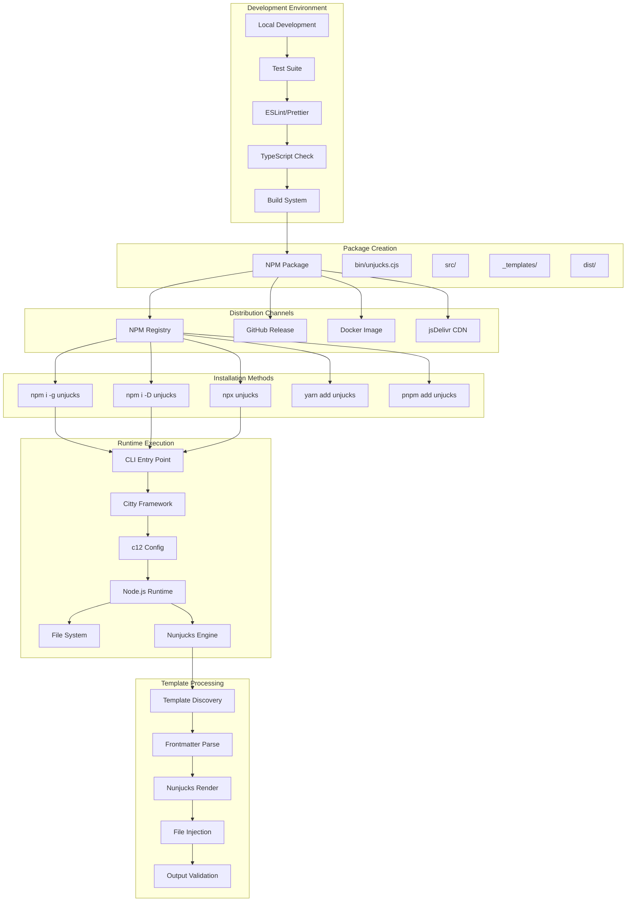
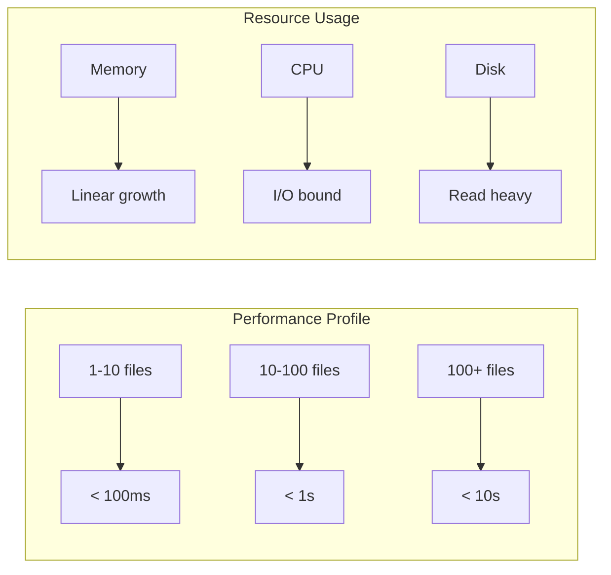
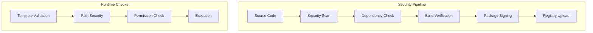

# Unjucks v3 Deployment Architecture

## Overview

Unjucks v3 deployment architecture supports multiple distribution channels and installation methods, ensuring broad compatibility across development environments while maintaining performance and security.

## Deployment Pipeline



## Package Structure

### Core Package Layout
```
unjucks/
├── package.json           # NPM package manifest
├── bin/
│   └── unjucks.cjs       # CLI entry point (CommonJS)
├── src/                  # Source code (ESM)
│   ├── index.js         # Main export
│   ├── cli/             # CLI implementation
│   ├── core/            # Core engine
│   ├── generators/      # Built-in generators
│   └── utils/           # Utilities
├── _templates/          # Default templates
├── dist/               # Built artifacts
├── docs/               # Documentation
└── tests/              # Test suite
```

### Distribution Artifacts

#### NPM Package
- **Size**: < 2MB compressed
- **Dependencies**: Minimal (Citty, Nunjucks, c12)
- **Node Version**: >= 18.0.0
- **Platform**: Cross-platform (Windows, macOS, Linux)

#### Binary Distribution
```javascript
// bin/unjucks.cjs - Entry point
#!/usr/bin/env node
const { defineCommand, runMain } = require('citty');
const { createUnjucks } = require('../dist/index.cjs');

// CLI definition and execution
```

## Dependencies & Runtime Requirements

### Core Dependencies
```json
{
  "dependencies": {
    "citty": "^0.1.5",      // CLI framework
    "c12": "^1.8.0",        // Configuration loader
    "nunjucks": "^3.2.4",   // Template engine
    "pathe": "^1.1.1",      // Path utilities
    "consola": "^3.2.3",    // Logging
    "picocolors": "^1.0.0"  // Terminal colors
  }
}
```

### Development Dependencies
```json
{
  "devDependencies": {
    "@types/node": "^20.0.0",
    "typescript": "^5.3.0",
    "vitest": "^1.0.0",
    "eslint": "^8.0.0",
    "prettier": "^3.0.0",
    "unbuild": "^2.0.0"
  }
}
```

### Runtime Environment
- **Node.js**: >= 18.0.0 (LTS)
- **Memory**: 50-100MB typical usage
- **Disk**: < 10MB installed size
- **CPU**: Single-threaded, I/O bound

## Installation Scenarios

### Global Installation
```bash
# Install globally for system-wide access
npm install -g unjucks

# Usage from anywhere
unjucks generate component Button
```

### Project-local Installation
```bash
# Install as dev dependency
npm install -D unjucks

# Usage via npx or package scripts
npx unjucks generate component Button
```

### Direct Execution
```bash
# No installation required
npx unjucks@latest generate component Button
```

## Build Process

### Development Build
```bash
# Development workflow
npm run dev           # Watch mode
npm run test          # Run tests
npm run lint          # Code quality
npm run typecheck     # Type validation
```

### Production Build
```bash
# Production build pipeline
npm run build         # TypeScript → JavaScript
npm run bundle        # Create distribution
npm run package       # NPM package
npm run publish       # Release to registry
```

### Build Configuration
```javascript
// unbuild.config.ts
export default {
  entries: [
    'src/index',
    'src/cli/index'
  ],
  declaration: true,
  rollup: {
    emitCJS: true,
    inlineDependencies: true
  }
}
```

## Distribution Strategy

### NPM Registry
- **Primary**: npmjs.com
- **Backup**: GitHub Packages
- **CDN**: jsDelivr automatic sync
- **Versioning**: Semantic versioning (semver)

### Release Channels
```bash
# Stable releases
npm publish --tag latest

# Beta releases  
npm publish --tag beta

# Alpha/development
npm publish --tag alpha
```

### GitHub Releases
- **Assets**: Tarball, checksums
- **Documentation**: Release notes
- **Automation**: GitHub Actions
- **Security**: Signed releases

## Docker Distribution

### Dockerfile
```dockerfile
FROM node:18-alpine

WORKDIR /app
COPY package*.json ./
RUN npm ci --only=production

COPY . .
EXPOSE 3000

ENTRYPOINT ["node", "bin/unjucks.cjs"]
```

### Docker Images
- **Base**: `unjucks:latest`
- **Alpine**: `unjucks:alpine`
- **Development**: `unjucks:dev`

## Performance Characteristics

### Startup Performance
- **Cold start**: < 100ms
- **Template discovery**: < 50ms
- **Configuration load**: < 25ms
- **Memory footprint**: 20-30MB initial

### Runtime Performance
- **Template render**: 1-10ms per file
- **File I/O**: Async, non-blocking
- **Concurrent operations**: Supported
- **Large files**: Streaming when possible

### Scaling Characteristics


## Security Considerations

### Package Security
- **Dependency scanning**: npm audit
- **Vulnerability monitoring**: Snyk
- **Code signing**: NPM provenance
- **Access control**: 2FA required

### Runtime Security
- **Path traversal**: Prevented
- **Template injection**: Sandboxed
- **File permissions**: Validated
- **Process isolation**: Single-threaded

### Supply Chain


## Monitoring & Telemetry

### Error Tracking
- **Crash reporting**: Optional
- **Usage analytics**: Anonymous
- **Performance metrics**: Aggregated
- **Error patterns**: Classification

### Health Checks
```bash
# Validate installation
unjucks --version
unjucks list
unjucks help

# System diagnostics
node --version        # Node.js version
npm --version         # NPM version
unjucks --debug info  # Debug information
```

## Deployment Automation

### CI/CD Pipeline
```yaml
# .github/workflows/deploy.yml
name: Deploy
on:
  push:
    tags: ['v*']

jobs:
  deploy:
    runs-on: ubuntu-latest
    steps:
      - uses: actions/checkout@v4
      - uses: actions/setup-node@v4
      - run: npm ci
      - run: npm run build
      - run: npm run test
      - run: npm publish
```

### Release Process
1. **Version bump**: `npm version [patch|minor|major]`
2. **Tag creation**: Automatic via npm version
3. **CI trigger**: GitHub Actions on tag push
4. **Build & test**: Automated pipeline
5. **Publish**: NPM registry upload
6. **Documentation**: Auto-generated release notes

## Rollback Strategy

### Version Management
```bash
# Rollback to previous version
npm unpublish unjucks@3.1.0
npm dist-tag add unjucks@3.0.9 latest

# User rollback
npm install unjucks@3.0.9
```

### Emergency Response
- **Hotfix branches**: `hotfix/critical-fix`
- **Fast deployment**: < 30 minutes
- **Notification**: Community alerts
- **Documentation**: Incident reports

This deployment architecture ensures reliable, secure, and performant distribution of Unjucks v3 across multiple platforms and installation methods while maintaining compatibility and ease of use.