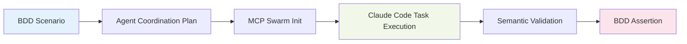

# Vitest-Cucumber to MCP Agent Coordination Workflow Mapping

## 🎯 Overview: BDD-Driven Agent Orchestration

This document maps **Behavior-Driven Development (BDD)** scenarios written in vitest-cucumber to **MCP agent coordination workflows**, creating a unified development experience where business requirements directly drive AI agent collaboration.

## 🔄 The BDD → MCP Agent Workflow Pattern

### **Core Mapping Strategy**


### **Workflow Transformation Matrix**

| BDD Element | MCP Agent Pattern | Claude Code Implementation | Validation |
|-------------|------------------|---------------------------|------------|
| **Feature** | Swarm topology selection | Task orchestration | End-to-end scenario |
| **Background** | Agent initialization | Parallel agent spawning | Setup validation |
| **Given** | Semantic context setup | Data preparation tasks | Pre-condition checks |
| **When** | Agent coordination triggers | Parallel task execution | Process monitoring |
| **Then** | Result validation | Output verification | Post-condition asserts |
| **And** | Cross-agent validation | Multi-agent coordination | Integration checks |

## 🧪 Detailed BDD → Agent Mapping Patterns

### **Pattern 1: Feature-Level Agent Swarm Initialization**

#### **BDD Feature Definition**
```gherkin
Feature: Enterprise Microservice Generation
  As a Fortune 5 enterprise architect
  I want semantic-aware AI agents to collaborate
  So that I can generate domain-specific microservices from ontologies
```

#### **MCP Agent Coordination**
```typescript
// Feature-level swarm initialization
describeFeature(feature, ({ Background, Scenario }) => {
  let swarmCoordinator: SwarmCoordinator;
  let semanticAgents: Map<string, Agent>;
  
  // Feature = Swarm Topology Selection
  beforeAll(async () => {
    // MCP coordination setup
    const swarmResult = await mcp_claude_flow_swarm_init({
      topology: "hierarchical", // Enterprise-optimized
      maxAgents: 8,
      strategy: "specialized"
    });
    
    swarmCoordinator = new SwarmCoordinator(swarmResult.swarmId);
  });
});
```

### **Pattern 2: Background-Level Agent Initialization**

#### **BDD Background Setup**
```gherkin
Background:
  Given I have a clean semantic environment
  And I have domain-specific agents available
  And I have enterprise ontology loaded
```

#### **Agent Spawning Strategy**
```typescript
Background(({ Given, And }) => {
  Given('I have a clean semantic environment', async () => {
    // Clear semantic cache and memory
    await swarmCoordinator.clearSemanticContext();
    testEnvironment = createCleanEnvironment();
  });

  And('I have domain-specific agents available', async () => {
    // Parallel agent spawning via Claude Code Task tool
    const agentPromises = [
      Task("Domain Expert Agent", 
           "Analyze enterprise domain ontologies and extract bounded contexts", 
           "researcher"),
      Task("Schema Validator Agent", 
           "Validate RDF syntax and semantic consistency across contexts", 
           "reviewer"),
      Task("API Generator Agent", 
           "Generate type-safe APIs from semantic definitions", 
           "backend-dev"),
      Task("Template Renderer Agent", 
           "Apply semantic data to Nunjucks templates with validation", 
           "coder"),
      Task("Integration Coordinator Agent", 
           "Ensure cross-system semantic alignment and consistency", 
           "system-architect")
    ];
    
    // Execute all agent spawning in parallel
    const agentResults = await Promise.all(agentPromises);
    
    // Store agent references for coordination
    semanticAgents.set('domain-expert', agentResults[0]);
    semanticAgents.set('schema-validator', agentResults[1]);
    semanticAgents.set('api-generator', agentResults[2]);
    semanticAgents.set('template-renderer', agentResults[3]);
    semanticAgents.set('integration-coordinator', agentResults[4]);
  });
});
```

### **Pattern 3: Scenario-Level Workflow Orchestration**

#### **BDD Scenario Execution**
```gherkin
Scenario: Generate payment microservice from financial ontology
  Given I have a financial domain ontology with payment entities
  And I have regulatory compliance requirements loaded
  When I coordinate agents to generate payment service architecture
  Then domain expert agents should identify payment bounded contexts  
  And schema validator agents should ensure PCI-DSS compliance
  And API generator agents should create secure payment interfaces
  And all agents should coordinate via shared semantic memory
```

#### **Agent Workflow Coordination**
```typescript
Scenario('Generate payment microservice from financial ontology', 
  ({ Given, And, When, Then }) => {
    
    let financialOntology: SemanticContext;
    let complianceRequirements: ComplianceRules;
    let coordinationResult: WorkflowResult;

    Given('I have a financial domain ontology with payment entities', async () => {
      financialOntology = await loadFinancialOntology(`
        @prefix finance: <http://financial.corp/ontology/> .
        @prefix compliance: <http://financial.corp/compliance/> .
        
        finance:PaymentService rdf:type schema:SoftwareApplication ;
            schema:name "Payment Processing Service" ;
            finance:processingCapability "CreditCard", "DebitCard", "ACH" ;
            compliance:requirement "PCI-DSS", "SOX" ;
            finance:maxTransactionAmount "1000000"^^xsd:decimal .
      `);
      
      expect(financialOntology.entities.length).toBeGreaterThan(0);
    });

    When('I coordinate agents to generate payment service architecture', async () => {
      // Orchestrate multi-agent workflow
      coordinationResult = await swarmCoordinator.orchestrateWorkflow({
        workflowType: 'semantic-microservice-generation',
        context: financialOntology,
        compliance: complianceRequirements,
        agents: Array.from(semanticAgents.values())
      });
      
      // Each agent executes with coordination hooks
      const agentTasks = [
        {
          agent: semanticAgents.get('domain-expert'),
          task: 'Extract payment domain bounded contexts',
          hooks: {
            pre: 'npx claude-flow@alpha hooks pre-task --description "payment-domain-analysis"',
            post: 'npx claude-flow@alpha hooks post-edit --memory-key "domain/payment-contexts"'
          }
        },
        {
          agent: semanticAgents.get('schema-validator'),
          task: 'Validate PCI-DSS compliance in semantic model',
          hooks: {
            pre: 'npx claude-flow@alpha hooks pre-task --description "compliance-validation"',
            post: 'npx claude-flow@alpha hooks post-edit --memory-key "compliance/pci-dss"'
          }
        },
        {
          agent: semanticAgents.get('api-generator'),
          task: 'Generate secure payment API interfaces',
          hooks: {
            pre: 'npx claude-flow@alpha hooks semantic-context --ontology-file "financial.ttl"',
            post: 'npx claude-flow@alpha hooks post-edit --file "payment-api.ts"'
          }
        }
      ];
      
      coordinationResult.agentExecutions = await Promise.all(
        agentTasks.map(({ agent, task, hooks }) => 
          agent.executeWithHooks(task, hooks)
        )
      );
    });

    Then('domain expert agents should identify payment bounded contexts', () => {
      const domainExpertResult = coordinationResult.agentExecutions.find(
        r => r.agentType === 'domain-expert'
      );
      
      expect(domainExpertResult.success).toBe(true);
      expect(domainExpertResult.boundedContexts).toContain('PaymentProcessing');
      expect(domainExpertResult.boundedContexts).toContain('ComplianceValidation');
    });
  }
);
```

## 🔧 Advanced BDD-Agent Coordination Patterns

### **Pattern 4: Parallel Agent Coordination with Shared Memory**

#### **BDD Scenario for Parallel Processing**
```gherkin
Scenario: Parallel microservice generation with semantic consistency
  Given I have multiple domain ontologies for different services
  When I coordinate parallel generation across all services
  Then agents should maintain semantic consistency across services
  And shared memory should contain cross-service alignment data
```

#### **Parallel Agent Implementation**
```typescript
When('I coordinate parallel generation across all services', async () => {
  const services = ['payment', 'user', 'notification', 'audit'];
  
  // Parallel agent coordination for multiple services
  const parallelCoordination = await Promise.allSettled(
    services.map(service => 
      swarmCoordinator.orchestrateServiceGeneration({
        service,
        ontologyPath: `./ontologies/${service}.ttl`,
        agents: {
          domainExpert: semanticAgents.get('domain-expert'),
          schemaValidator: semanticAgents.get('schema-validator'),
          apiGenerator: semanticAgents.get('api-generator')
        },
        sharedMemory: swarmCoordinator.getSharedSemanticMemory()
      })
    )
  );
  
  const successfulGenerations = parallelCoordination
    .filter(result => result.status === 'fulfilled')
    .map(result => (result as PromiseFulfilledResult<any>).value);
    
  expect(successfulGenerations).toHaveLength(4);
  coordinationResult.parallelResults = successfulGenerations;
});
```

### **Pattern 5: Error Handling and Agent Recovery**

#### **BDD Error Scenario**
```gherkin
Scenario: Handle semantic validation failures gracefully
  Given I have an ontology with semantic inconsistencies
  When I attempt coordinated generation with invalid data
  Then schema validator agents should detect inconsistencies
  And the system should recover with degraded functionality
  And other agents should continue with available valid data
```

#### **Error Recovery Implementation**
```typescript
When('I attempt coordinated generation with invalid data', async () => {
  try {
    coordinationResult = await swarmCoordinator.orchestrateWorkflow({
      workflowType: 'semantic-generation-with-validation',
      context: invalidOntology,
      errorHandling: 'graceful-degradation',
      agents: Array.from(semanticAgents.values())
    });
  } catch (coordi

Then('schema validator agents should detect inconsistencies', () => {
  const validatorResult = coordinationResult.agentExecutions.find(
    r => r.agentType === 'schema-validator'
  );
  
  expect(validatorResult.success).toBe(false);
  expect(validatorResult.errors).toContain('Semantic inconsistency detected');
  expect(validatorResult.recoveryAction).toBe('Continue with valid subset');
});

And('the system should recover with degraded functionality', () => {
  expect(coordinationResult.overallSuccess).toBe(true); // Partial success
  expect(coordinationResult.degradedMode).toBe(true);
  expect(coordinationResult.validEntitiesProcessed).toBeGreaterThan(0);
});
```

## 📊 Performance-Optimized BDD-Agent Patterns

### **Pattern 6: Cached Agent Coordination**

#### **BDD Caching Scenario**
```gherkin
Scenario: Optimize repeated semantic processing with intelligent caching
  Given I have previously processed a domain ontology
  When I repeat the same semantic coordination workflow
  Then agents should leverage cached semantic analysis
  And coordination time should be dramatically reduced
  And semantic consistency should be maintained
```

#### **Caching Implementation**
```typescript
When('I repeat the same semantic coordination workflow', async () => {
  const cacheKey = swarmCoordinator.generateCacheKey({
    ontologyHash: financialOntology.hash,
    agentConfiguration: semanticAgents.getConfiguration(),
    workflowType: 'semantic-microservice-generation'
  });
  
  // Check for cached results
  const cachedResult = await swarmCoordinator.getCachedResult(cacheKey);
  
  if (cachedResult) {
    coordinationResult = {
      ...cachedResult,
      fromCache: true,
      cacheHitTime: performance.now()
    };
  } else {
    // Execute full workflow and cache result
    coordinationResult = await swarmCoordinator.orchestrateWorkflow({
      workflowType: 'semantic-microservice-generation',
      context: financialOntology,
      agents: Array.from(semanticAgents.values()),
      cacheResult: true,
      cacheKey
    });
  }
});

Then('coordination time should be dramatically reduced', () => {
  if (coordinationResult.fromCache) {
    expect(coordinationResult.totalTime).toBeLessThan(100); // Sub-100ms
  }
  expect(coordinationResult.success).toBe(true);
});
```

## 🎯 BDD Test Execution Optimization

### **Concurrent BDD-Agent Test Execution**
```typescript
// vitest.config.ts - Optimized for BDD-Agent coordination
export default defineConfig({
  test: {
    // BDD-specific parallel execution
    pool: "threads",
    poolOptions: {
      threads: {
        maxThreads: Math.min(8, os.cpus().length),
        useAtomics: true,  // Enable shared memory for agent coordination
        isolate: false     // Share semantic contexts between tests
      }
    },
    
    // BDD test patterns for MCP coordination
    include: [
      "tests/**/*.mcp-coordination.spec.ts",
      "tests/**/*.semantic-bdd.spec.ts",
      "tests/**/*.agent-workflow.spec.ts"
    ],
    
    // Shared semantic memory for test isolation
    globalSetup: './tests/setup/mcp-coordination.setup.ts',
    setupFiles: ['./tests/setup/semantic-agents.setup.ts'],
    
    // Performance monitoring for agent coordination
    reporters: [
      'default',
      ['custom-mcp-reporter', { 
        trackAgentPerformance: true,
        semanticMemoryUsage: true 
      }]
    ]
  }
});
```

### **MCP Agent Coordination Setup**
```typescript
// tests/setup/mcp-coordination.setup.ts
export async function setup() {
  // Global MCP swarm initialization for all BDD tests
  globalThis.mcpSwarmCoordinator = await initializeMcpSwarm({
    topology: 'mesh',
    maxAgents: 10,
    semanticCacheEnabled: true,
    performanceMonitoring: true
  });
  
  // Pre-warm semantic agents for faster test execution
  await globalThis.mcpSwarmCoordinator.preloadSemanticAgents([
    'domain-expert',
    'schema-validator', 
    'code-generator',
    'template-renderer',
    'integration-coordinator'
  ]);
}
```

## 📈 Success Metrics and Validation

### **BDD-Agent Coordination KPIs**
```typescript
interface BddAgentMetrics {
  // Performance metrics
  scenarioExecutionTime: number;
  agentSpawnTime: number;
  coordinationOverhead: number;
  
  // Quality metrics
  semanticConsistency: number; // 0-1 score
  agentCollaborationSuccess: number; // 0-1 score
  errorRecoveryEffectiveness: number; // 0-1 score
  
  // Resource metrics
  memoryUsage: {
    peakSemanticMemory: number;
    sharedMemoryEfficiency: number;
    cacheHitRatio: number;
  };
}
```

### **Automated Validation Patterns**
```gherkin
Feature: BDD-Agent Coordination Performance Validation
  
  Scenario: Validate coordination meets performance SLAs
    Given I have a complex semantic workflow
    When I execute BDD scenarios with agent coordination
    Then total execution time should be under 2 seconds
    And agent spawn time should be under 200ms  
    And memory usage should remain stable
    And cache hit ratio should exceed 80% for repeat scenarios
```

## 🎯 Implementation Roadmap

### **Phase 1: Core BDD-Agent Integration (Week 1)**
1. **Day 1-2**: Basic BDD to agent mapping patterns
2. **Day 3**: Parallel agent spawning in BDD scenarios  
3. **Day 4**: Shared semantic memory integration
4. **Day 5**: Error handling and recovery patterns

### **Phase 2: Advanced Coordination (Week 2)**
1. **Day 6-7**: Performance optimization and caching
2. **Day 8**: Complex multi-agent workflows
3. **Day 9**: Cross-scenario semantic consistency
4. **Day 10**: Monitoring and metrics integration

### **Phase 3: Production Optimization (Week 3)**
1. **Day 11-12**: Load testing with large ontologies
2. **Day 13**: Memory optimization and leak prevention
3. **Day 14**: CI/CD pipeline integration
4. **Day 15**: Documentation and developer experience

## 🏁 Conclusion

This BDD-Agent coordination mapping creates a **unified development experience** where:

- **Business requirements** (BDD scenarios) directly drive **AI agent collaboration**
- **Semantic consistency** is validated through behavior-driven testing
- **Performance optimization** is built into the development workflow
- **Error recovery** and **degraded functionality** are tested as first-class concerns

**Result**: Development teams can write business-focused BDD scenarios that automatically orchestrate sophisticated AI agent workflows for semantic code generation at enterprise scale.