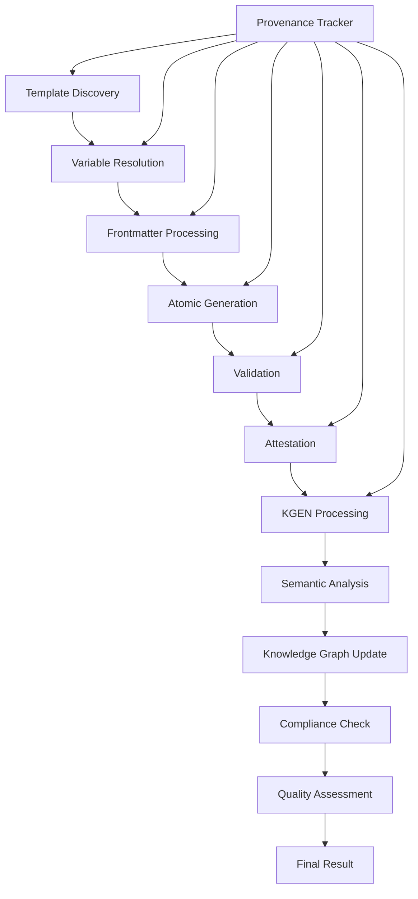

# Workflow Integration Architecture

## Overview

The Workflow Integration Orchestrator provides seamless end-to-end integration from unjucks template discovery to KGEN semantic processing, maintaining deterministic guarantees across all workflow components with comprehensive provenance tracking.

## Architecture Components

### 1. WorkflowOrchestrator (`/src/workflows/orchestrator.js`)

**Primary Responsibilities:**
- Template discovery and indexing
- Variable extraction and resolution
- Frontmatter processing and execution
- Atomic file operations with rollback
- Artifact generation and validation
- Provenance tracking integration

**Key Features:**
- **6-Phase Pipeline:** Discovery → Variable Resolution → Frontmatter Processing → Atomic Generation → Validation → Attestation
- **Atomic Transactions:** Complete rollback capability for failed operations
- **Real-time Provenance:** Full PROV-O compliant tracking
- **Error Recovery:** Graceful handling with configurable retry strategies
- **Performance Optimization:** Parallel execution and caching

### 2. KgenBridge (`/src/integrations/kgen-bridge.js`)

**Primary Responsibilities:**
- Semantic analysis of generated artifacts
- Knowledge graph integration and entity extraction
- Compliance validation (GDPR, SOX, HIPAA)
- Quality assessment and recommendations
- Cryptographic attestation generation

**Key Features:**
- **Multi-language Analysis:** JavaScript/TypeScript, Python, Java, Go, Rust
- **Pattern Detection:** Security issues, code quality, maintainability
- **Compliance Frameworks:** Automated regulatory compliance checking
- **Knowledge Graph:** Entity relationship extraction and ontology mapping
- **Caching System:** Semantic analysis result caching for performance

## Integration Flow



## Workflow Phases

### Phase 1: Template Discovery and Selection

**Process:**
- Scan template directories for `.njk` and `.ejs` files
- Parse frontmatter configuration
- Extract variable requirements
- Build template index with metadata
- Support explicit, generator-based, and auto-discovery modes

**Output:**
- Discovered template objects with full metadata
- Variable dependency mapping
- Generator categorization

### Phase 2: Variable Resolution and Validation

**Process:**
- Extract required variables from template content
- Resolve from multiple sources (explicit, registry, environment)
- Apply default values and transformations
- Validate against type and pattern constraints
- Generate missing variables with intelligent defaults

**Output:**
- Complete resolved variable set
- Validation reports
- Type-checked values

### Phase 3: Frontmatter Processing and Template Preparation

**Process:**
- Parse frontmatter directives (`to`, `inject`, `skipIf`, etc.)
- Resolve dynamic paths with variable substitution
- Evaluate conditional logic for skipping
- Prepare injection parameters (mode, position, patterns)
- Render template content with variables

**Output:**
- Processed templates with resolved paths
- Rendered content ready for generation
- Injection configuration

### Phase 4: Atomic Generation with Error Handling

**Process:**
- Execute file operations within atomic transactions
- Support both file creation and content injection
- Maintain rollback state for failure recovery
- Apply permissions and post-processing commands
- Generate checksums for integrity verification

**Output:**
- Generated artifacts with metadata
- Transaction log for rollback capability
- Integrity checksums

### Phase 5: Validation and KGEN Integration

**Process:**
- Validate generated artifacts (existence, integrity, syntax)
- Perform semantic analysis through KGEN bridge
- Extract entities and relationships
- Update knowledge graph
- Generate quality metrics

**Output:**
- Validation reports with pass/fail status
- Semantic analysis results
- Knowledge graph updates

### Phase 6: Artifact Attestation and Provenance Completion

**Process:**
- Generate cryptographic attestations for valid artifacts
- Complete provenance tracking with integrity hashes
- Optional blockchain anchoring for immutable records
- Store results in persistent storage
- Generate final workflow report

**Output:**
- Cryptographic attestations
- Complete provenance records
- Final workflow result with metrics

## KGEN Integration

### Semantic Analysis Engine

**JavaScript/TypeScript Analysis:**
- Function and class counting
- Import/export analysis
- Cyclomatic complexity calculation
- Pattern detection (async/await, promises, ES6 features)
- Security issue identification

**Multi-language Support:**
- Python: Function, class, import analysis
- Java: Method, class, interface analysis
- Go: Function, struct, interface analysis
- Rust: Function, struct, enum, trait analysis
- Generic: Basic metrics for unknown languages

### Knowledge Graph Integration

**Entity Extraction:**
- Artifacts → Graph entities with properties
- Templates → Template entities with metadata
- Relationships → Usage and generation links
- Ontology mapping to standard vocabularies

**Relationship Types:**
- `generates`: Template generates artifact
- `depends-on`: Artifact depends on external resources
- `uses`: Activity uses entity
- `derived-from`: Entity derived from source

### Compliance Framework

**GDPR Compliance:**
- Personal data detection
- Data retention policy validation
- Consent tracking
- Right to erasure support

**SOX Compliance:**
- Audit trail completeness
- Control validation
- Financial data protection
- Change management tracking

**HIPAA Compliance:**
- Protected health information detection
- Encryption requirement validation
- Access control verification
- Audit logging compliance

## Quality Assessment

### Metrics Calculation

**Completeness:** `actualArtifacts / expectedArtifacts`
**Correctness:** `validArtifacts / totalArtifacts`
**Consistency:** `consistentPatterns / maxPatterns`
**Maintainability:** Pattern-based scoring (high/medium/low)
**Security:** Security issue detection and scoring
**Compliance:** Regulatory framework adherence

### Quality Scoring

- **Excellent:** Overall score ≥ 0.9
- **Good:** Overall score ≥ 0.7
- **Acceptable:** Overall score ≥ 0.5
- **Poor:** Overall score < 0.5

## Error Handling and Recovery

### Atomic Transaction System

**Rollback Capabilities:**
- File creation rollback with backup restoration
- Content injection rollback to original state
- Permission restoration
- Directory cleanup

**Error Recovery Strategies:**
- Template processing: Skip invalid templates with warning
- Variable resolution: Apply intelligent defaults
- File operations: Retry with exponential backoff
- Validation: Continue with warnings for non-critical issues

### Provenance Error Handling

**Error Recording:**
- Complete operation context preservation
- Error stack trace and metadata
- Recovery action documentation
- Audit trail continuation

## Performance Optimization

### Caching Strategy

**Semantic Analysis Cache:**
- Content-based cache keys (checksums)
- LRU eviction policy
- Cross-session persistence option

**Template Index Cache:**
- File modification time tracking
- Incremental updates
- Memory-efficient storage

### Parallel Processing

**Concurrent Template Processing:**
- Independent template rendering
- Parallel semantic analysis
- Batch knowledge graph updates

**Resource Management:**
- Configurable concurrency limits
- Memory usage monitoring
- Graceful degradation under load

## Configuration Options

### WorkflowOrchestrator Config

```javascript
{
  templatePath: './templates',           // Template discovery path
  outputPath: './src',                  // Default output directory
  enableProvenance: true,               // PROV-O tracking
  atomicOperations: true,               // Atomic transactions
  validateOutputs: true,                // Artifact validation
  errorRecovery: true,                  // Error recovery
  maxRetries: 3,                        // Retry attempts
  parallelExecution: true,              // Parallel processing
  batchSize: 10                         // Batch processing size
}
```

### KgenBridge Config

```javascript
{
  enableSemanticProcessing: true,       // Semantic analysis
  enableKnowledgeGraph: true,           // Knowledge graph integration
  enableComplianceTracking: true,       // Regulatory compliance
  enableBlockchainAnchoring: false,     // Blockchain integrity
  realTimeProcessing: true,             // Real-time analysis
  cacheEnabled: true,                   // Result caching
  maxConcurrency: 5,                    // Analysis concurrency
  storageBackend: 'file'                // Persistence backend
}
```

## API Usage Examples

### Basic Workflow Execution

```javascript
import { WorkflowOrchestrator } from './src/workflows/orchestrator.js';
import { KgenBridge } from './src/integrations/kgen-bridge.js';

// Initialize components
const orchestrator = new WorkflowOrchestrator({
  templatePath: './templates',
  enableProvenance: true
});

const kgenBridge = new KgenBridge({
  enableSemanticProcessing: true,
  enableComplianceTracking: true
});

await orchestrator.initialize();
await kgenBridge.initialize();

// Execute workflow
const workflowSpec = {
  id: 'user-service-generation',
  generator: 'service',
  variables: {
    name: 'UserService',
    description: 'Manages user operations',
    withTests: true,
    withDocs: true
  },
  user: {
    id: 'developer',
    name: 'John Developer',
    email: 'john@company.com'
  }
};

const workflowResult = await orchestrator.executeWorkflow(workflowSpec);
const kgenResult = await kgenBridge.processWorkflowResult(workflowResult);

console.log('Workflow completed:', workflowResult.status);
console.log('Quality assessment:', kgenResult.qualityMetrics.overall);
console.log('Compliance status:', kgenResult.kgenAnalysis.compliance.compliant);
```

### Advanced Configuration

```javascript
// Template with complex frontmatter
const complexTemplate = `---
{
  "to": "{{name}}/{{name}}.{{extension}}",
  "inject": false,
  "skipIf": "skipService",
  "chmod": "755",
  "sh": "npm run lint {{name}}/{{name}}.{{extension}}"
}
---
export class {{name}} {
  constructor({{#if withDI}}dependencies{{/if}}) {
    this.name = '{{name}}';
    {{#if withDI}}
    this.deps = dependencies;
    {{/if}}
  }
  
  async {{methodName}}() {
    // {{description}}
    return await this.process();
  }
}
`;

// Workflow with conditional generation
const conditionalWorkflow = {
  id: 'conditional-generation',
  templates: [
    {
      name: 'service',
      variables: { name: 'AuthService', withDI: true },
      options: { skipService: false }
    },
    {
      name: 'test',
      variables: { name: 'AuthService' },
      options: { skipService: process.env.NODE_ENV === 'production' }
    }
  ]
};
```

## Testing and Validation

### Comprehensive Test Suite

The integration includes extensive end-to-end tests covering:

- **Complete Workflow Pipeline:** Discovery to KGEN analysis
- **Error Handling:** Graceful error recovery and rollback
- **Performance:** Multi-template processing efficiency
- **Caching:** Semantic analysis result caching
- **Compliance:** GDPR, SOX, HIPAA validation
- **Security:** Security issue detection
- **Knowledge Graph:** Entity and relationship extraction

### Test Coverage Areas

- Template discovery and variable resolution
- Frontmatter processing and atomic generation
- Provenance tracking throughout pipeline
- KGEN semantic analysis accuracy
- Quality metric calculation
- Compliance framework validation
- Error recovery mechanisms
- Performance under load

## Monitoring and Metrics

### Orchestrator Metrics

- Total workflows executed
- Success/failure rates
- Average execution time
- Templates processed
- Artifacts generated
- Error recovery statistics

### KGEN Bridge Metrics

- Semantic analyses performed
- Knowledge graph updates
- Compliance checks completed
- Cache hit/miss ratios
- Processing error rates
- Quality assessment distribution

## Integration Benefits

1. **Deterministic Guarantees:** Complete reproducibility through provenance tracking
2. **Enterprise Compliance:** Built-in regulatory compliance validation
3. **Quality Assurance:** Automated quality assessment and recommendations
4. **Error Resilience:** Comprehensive error handling with rollback capability
5. **Performance Optimization:** Caching and parallel processing
6. **Knowledge Management:** Semantic understanding and knowledge graph integration
7. **Security:** Automated security issue detection and cryptographic integrity
8. **Auditability:** Complete audit trail for enterprise accountability

This architecture provides a robust, scalable, and compliant solution for integrating template-based code generation with advanced semantic processing and knowledge management capabilities.