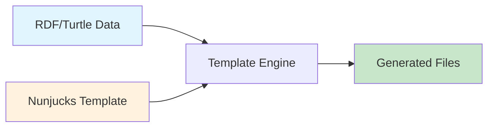

# 🎯 Semantic Template Generation Examples

This directory contains **FOCUSED** examples showing the **CORE PURPOSE** of Unjucks:
**Generating files from templates using RDF/Turtle semantic data**

## 📁 Examples Overview

### 1. `basic-component-from-rdf.ts`
Generate React components from RDF descriptions of UI elements
- **Input**: RDF describing component props and structure  
- **Output**: TypeScript React component file

### 2. `api-from-ontology.ts`
Generate REST API routes and controllers from RDF ontology
- **Input**: RDF/OWL describing API endpoints
- **Output**: Express routes, controllers, validation

### 3. `database-schema-from-rdf.ts`
Generate database schemas from semantic domain models
- **Input**: OWL ontology describing entities and relationships
- **Output**: Prisma schema, SQL DDL, migrations

### 4. `config-from-turtle.ts`
Generate configuration files from RDF config data
- **Input**: Turtle file with environment configurations
- **Output**: TypeScript config, .env files, Docker Compose

## 🔄 The Unjucks Workflow



## 💡 Key Concepts

### RDF as Template Variables
```turtle
# Define data in RDF
ex:component rdfs:label "UserCard" ;
    ui:hasProperty ex:name, ex:email ;
    ui:styling "modern" .
```

### Template with RDF Filters
```nunjucks
---
to: src/components/{{ $rdf | rdfLabel }}.tsx
rdf: ./component.ttl
---
export const {{ $rdf | rdfLabel }} = () => {
  // Component generated from RDF data
};
```

### Generated Output
```typescript
export const UserCard = () => {
  // Component generated from RDF data
};
```

## 🚀 Running Examples

```bash
# Install dependencies
npm install

# Run component generation
npx tsx examples/semantic-generation/basic-component-from-rdf.ts

# Run API generation
npx tsx examples/semantic-generation/api-from-ontology.ts

# Run database schema generation
npx tsx examples/semantic-generation/database-schema-from-rdf.ts

# Run config generation
npx tsx examples/semantic-generation/config-from-turtle.ts
```

## ✅ What These Examples Show

1. **RDF → Code**: Semantic data becomes actual source code
2. **Template-Driven**: Nunjucks templates define output structure
3. **Type-Safe**: Generated TypeScript with proper types
4. **Practical**: Real-world use cases, not theoretical

## ❌ What These Examples DON'T Show

- Enterprise deployment scenarios
- Fortune 500 compliance
- Complex monitoring systems
- Healthcare/Financial specific features

**Why?** Because Unjucks is a **template generator**, not a deployment platform!

## 📚 Learn More

- [RDF Filters Documentation](../rdf-filters-usage.md)
- [Template Examples](../rdf-template-example.md)
- [Unjucks CLI Usage](../../README.md#cli-usage)

---

**Remember**: Unjucks = Templates + RDF Data = Generated Files. That's it!